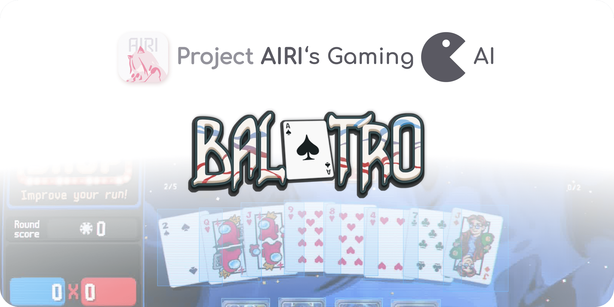
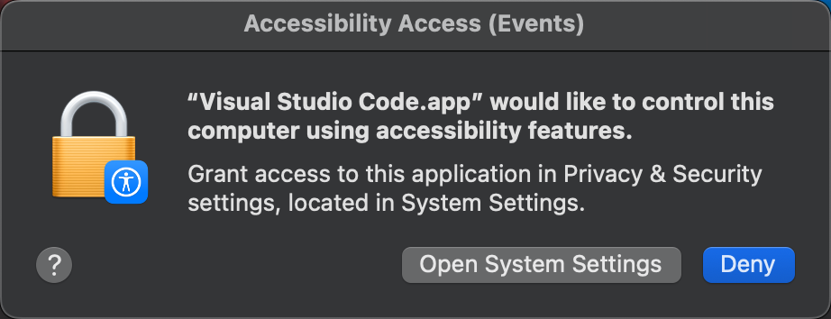
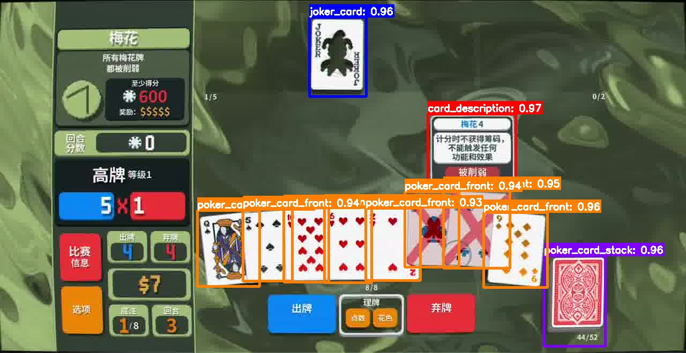
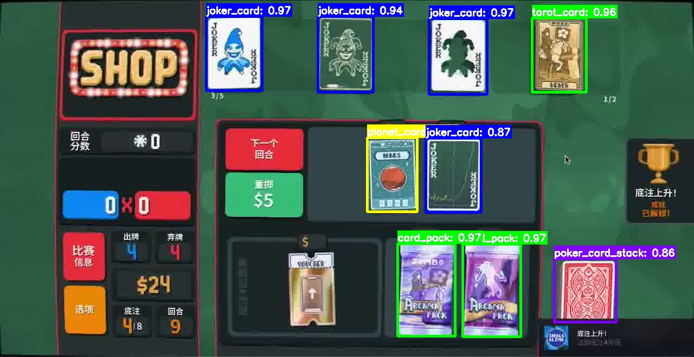
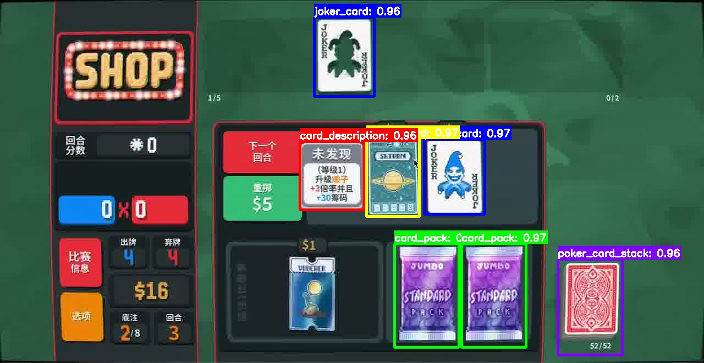
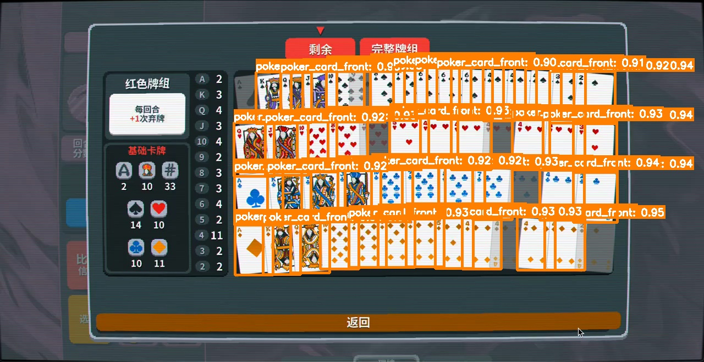
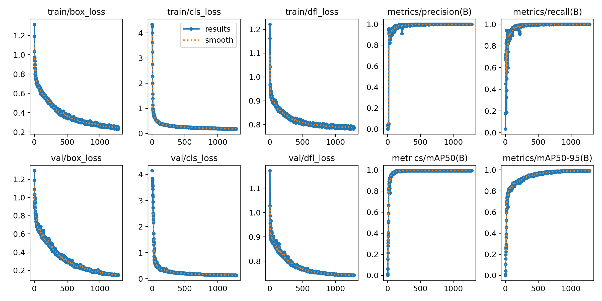
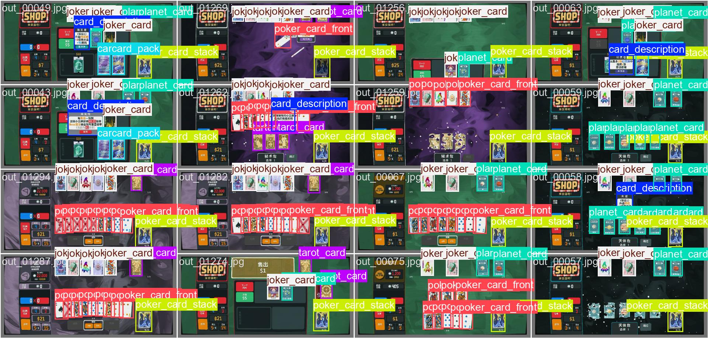

<p align="center">
  
</p>

<h1 align="center">
  Game AI - Balatro
</h1>

<p align="center">
  🤗 <a href="https://huggingface.co/proj-airi/games-balatro-2024-yolo-entities-detection">Model</a> | 🤗 <a href="https://huggingface.co/datasets/proj-airi/games-balatro-2024-entities-detection">Dataset</a>
</p>

> This project is part of (and also associate to) the [Project AIRI](https://github.com/moeru-ai/airi), we aim to build a LLM-driven VTuber like [Neuro-sama](https://www.youtube.com/@Neurosama) (subscribe if you didn't!) if you are interested in, please do give it a try on [live demo](https://airi.moeru.ai).
>
> Who are we?
>
> We are a group of currently non-funded talented people made up with computer scientists, experts in multi-modal fields, designers, product managers, and popular open source contributors who loves the goal of where we are heading now.

## Development

```shell
git clone git@github.com:proj-airi/game-playing-ai-balatro.git
git lfs install
git submodule init
git submodule update

pixi install
```

> [!NOTE]
> For macOS, when running the UI automation and doing Game AI playing, you may need to give the terminal (or your IDE, in our case, Visual Studio Code) the permissions:
>
> - Access to other apps
>   
> - Screen Recording
>   
> - Bypass private window picker
>   
> - Accessibility
>   
>
> After assigning the permissions, please restart your terminal or IDE to make it work.

## Models

| Basic                     | Multiple card types       | Description               | Crowded cards             |
| ------------------------- | ------------------------- | ------------------------- | ------------------------- |
|  |  |  |  |

### Reproduce

1. Through script

```shell
pixi shell
python src/main.py
```

2. Through Notebook

Open `src/notebooks/Train.ipynb` and run all cells.

### Technical reports

#### Training

We trained this model on our own datasets labelled with n<1k images using Label Studio with YOLOv11n as the base model, it's
available on HuggingFace as well: [proj-airi/games-balatro-2024-entities-detection](https://huggingface.co/datasets/proj-airi/games-balatro-2024-entities-detection).

The training was performed on a single NVIDIA 4080Super GPU with 16GB VRAM, the loss optimized well and converged within set 2000 epochs.





## Citation

If you find our works useful for your research, please consider citing:

```bibtex
@misc{proj_airi_game_ai_balatro_2025,
  title        = {Game AI - Balatro (2024, game)},
  author       = {Project AIRI Team, Neko Ayaka, Makito, Rainbow Bird},
  howpublished = {\url{https://github.com/proj-airi/game-playing-ai-balatro}},
  year         = {2025}
}
```
