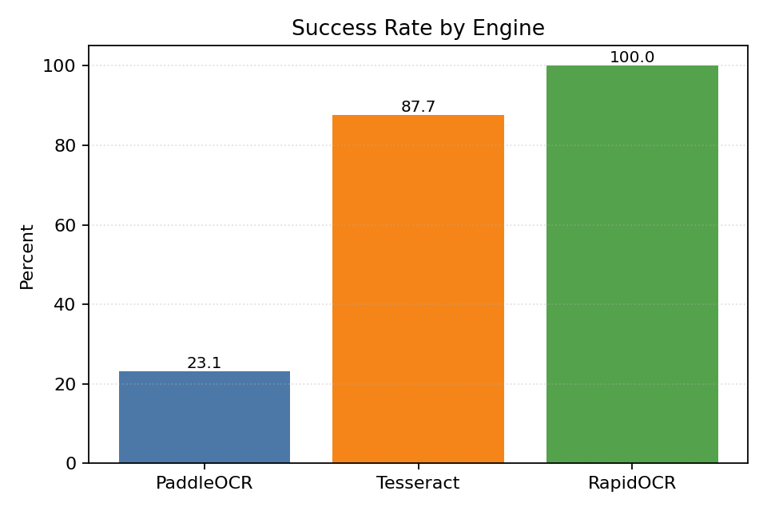
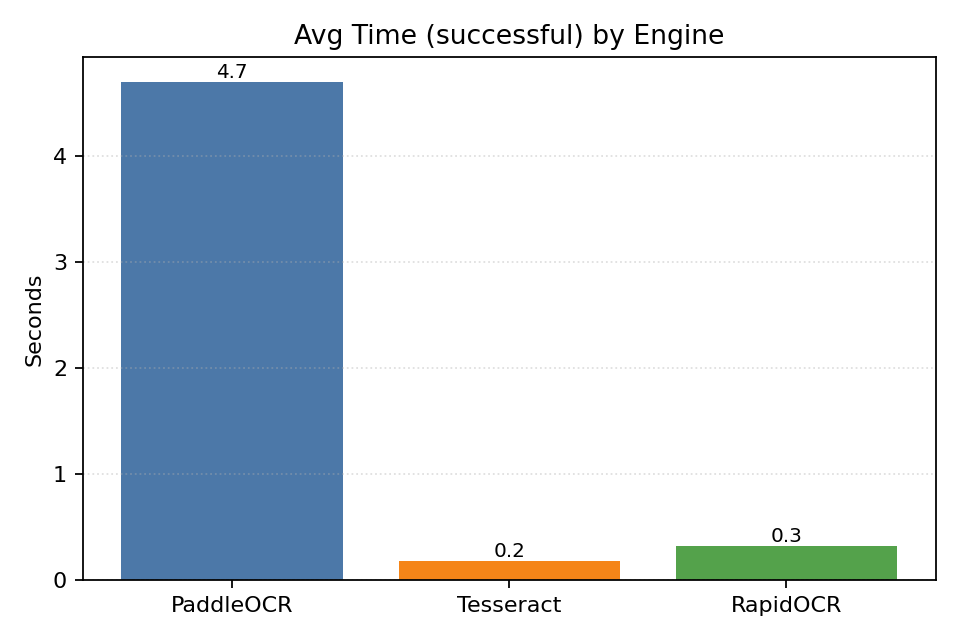
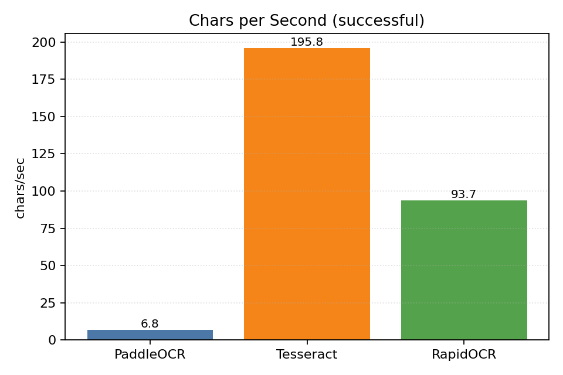

---
{
  "title": "Balatro OCR (Descriptions) Benchmark Findings",
  "date": "2025-09-22",
  "coding_agents": {
    "authors": [
      "neko",
      "Agent"
    ],
    "project": "proj-airi/game-playing-ai-balatro",
    "context": "Benchmark OCR engines on YOLO description crops",
    "technologies": [
      "YOLO",
      "EasyOCR",
      "PaddleOCR",
      "Tesseract",
      "OpenCV"
    ]
  },
  "tags": [
    "ocr",
    "benchmark",
    "balatro"
  ]
}
---

# Balatro OCR (Descriptions) Benchmark Findings

## Executive Summary
- Best success rate: **RapidOCR**
- Best efficiency (chars/sec): **Tesseract**
- 2x–3x scaling generally improves OCR accuracy for UI text.
- Tesseract requires language packs (eng, chi_sim) to participate fully.

## Figures

## Method
- Inputs: crops from description detections in out_00104, out_00166, out_00114.
- Engines: EasyOCR, PaddleOCR, Tesseract (mapped langs: en→eng, ch_sim→chi_sim).
- Variants: original/grayscale/binary/adaptive/enhanced × scale 1x/2x/3x.
- Metrics (successful only): success rate, avg time, extracted text length, chars/sec.